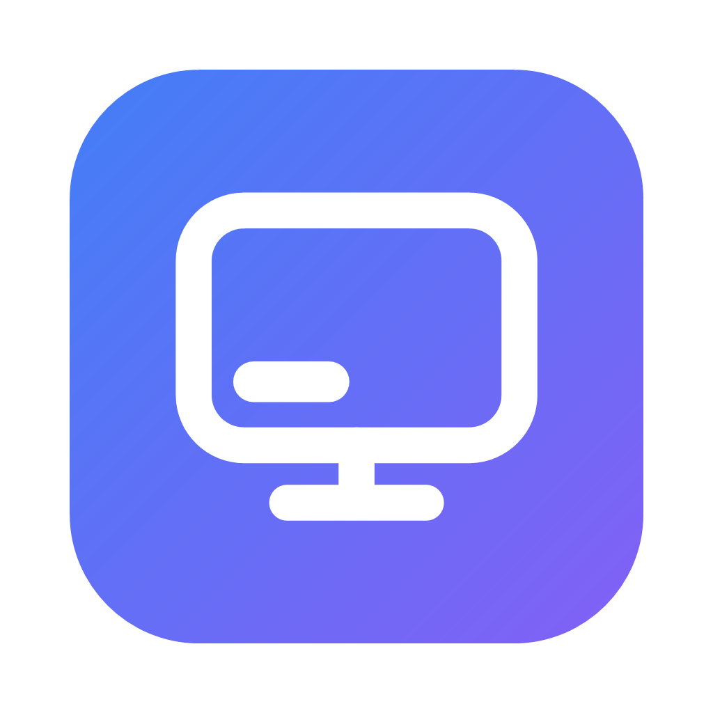

  

<h1 align="center">Remote Display</h1>

  Remote desktop for your Mac from Windows, iPad or another Mac — with <b>virtual monitors that fit your window</b>.

  <a href="https://remotedisplay.app">remotedisplay.app</a> ·
  <a href="https://github.com/SamuelRioTz/remotedisplay/releases/latest">Downloads</a> ·
  <a href="#how-it-works">How it works</a> ·
  <a href="LICENSE">AGPL-3.0</a>

---

Remote Display is a self-hosted remote desktop for macOS hosts. It is built on the
[RustDesk](https://github.com/rustdesk/rustdesk) engine (AGPL-3.0) and adds the thing
that made me want it in the first place: **the remote screen adapts to the window you
are looking at**, the way a virtual machine does in [Tart](https://tart.run) — no
letterboxing, no scrolling, no fixed resolutions.

## Features

- **Dynamic virtual monitors on the Mac.** Create a virtual display from the client;
  it is born at the size of your window. *Fit to screen* resizes it to the window at
  any time. Delete it when you are done.
- **Make the physical monitor dynamic.** *Fit to screen* on the Mac's real display
  mirrors it onto a virtual main display that follows your window. Flip the switch to
  get the physical display back.
- **Scale per monitor (100 / 125 / 150 / 200 %)**, like Windows display scaling.
  Retina (2×) when macOS allows it, 1× with fewer points otherwise.
- **Per-client monitor profiles.** Each client (your PC, your iPad) remembers its own
  layout and applies it when it connects, also after the Mac restarts the server.
- **Multi-window.** Open any monitor in its own window; "All monitors" shows them all.
- **No accounts, no cloud, no IDs.** Direct connection over your LAN or VPN
  (Tailscale works well), with a password you set. Nothing leaves your network.
- Clients for **Windows, macOS, Android and iOS** (Flutter); server for **macOS 14+**
  on Apple silicon (menu-bar app).

## Downloads

Binaries are on the [Releases](https://github.com/SamuelRioTz/remotedisplay/releases)
page: Windows installer and portable zip, macOS client and server DMGs, Android APK,
iOS IPA (development signing for now).

The macOS builds are Apple silicon only for now (the engine is not built for Intel) and
are signed ad hoc; on first launch use right-click → Open, or allow the app in System
Settings → Privacy & Security.

## Quick start

1. On the Mac, install **Remote Display Server** from the DMG, open it, turn the service
   on, grant Screen Recording and Accessibility, and set a password.
2. On the client, connect to the Mac's IP (port `21118`) with that password. Machines on
   the same LAN are discovered automatically.
3. Open the display menu in the toolbar: create a virtual monitor, hit *Fit to screen*,
   pick a scale.

## How it works

- `server-mac/` — the macOS menu-bar server (SwiftUI) bundling the engine as
  `remotedisplayd`. Virtual displays are created with `CGVirtualDisplay` and resized in
  place; the physical display is made "dynamic" by mirroring it onto a virtual main.
- `engine/rustdesk/` — a vendored fork of RustDesk 1.4.9 with the changes listed in
  [`HOOKS.md`](HOOKS.md) and [`tools/patches/`](tools/patches/): serverless LAN
  discovery, macOS virtual display backend, per-display scale, and a fix for the
  ColorSync profile leak that virtual displays cause on macOS.
- `client/` — the Flutter client (new UI on top of the engine's `flutter_hbb` package).
- `docs/tests/` — measurements and harnesses behind the macOS 26 quirks we hit
  (HiDPI behaviour, mirror sets, per-process display lists). Mostly in Spanish.
- `website/` — the landing page for [remotedisplay.app](https://remotedisplay.app):
  static HTML with EN/ES/DE strings in `website/l10n/`.

Build recipes: [`tools/README.md`](tools/README.md) (Windows and Mac),
[`release/README.md`](release/README.md) (how the release artifacts are produced).

## Known limitations

- Retina (2× backing) virtual displays only when the requested pixel width is ≥ 1920;
  below that macOS 26 flattens the mode to 1× and the scale is emulated with fewer points.
- `CGVirtualDisplay` is a private Apple API: this cannot ship on the Mac App Store and
  may change between macOS versions.
- Connections are direct (no relay yet). Use a LAN or a VPN.

## License

Remote Display is free software under the **GNU Affero General Public License v3.0**
(see [`LICENSE`](LICENSE)). It contains a modified copy of
[RustDesk](https://github.com/rustdesk/rustdesk) (© RustDesk contributors, AGPL-3.0);
see [`NOTICE.md`](NOTICE.md). RustDesk is a trademark of its owners; this project is not
affiliated with them.
