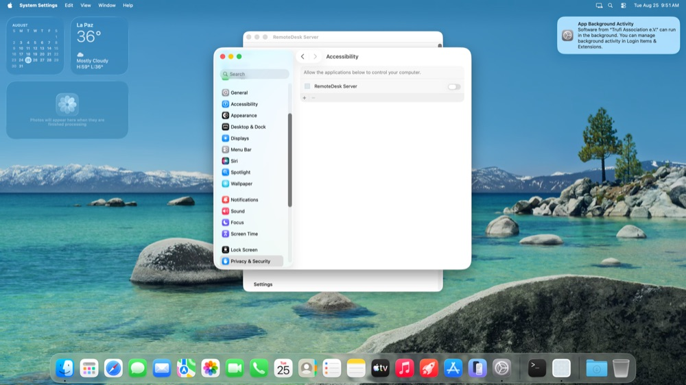
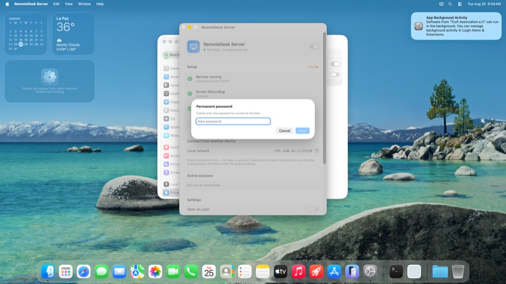
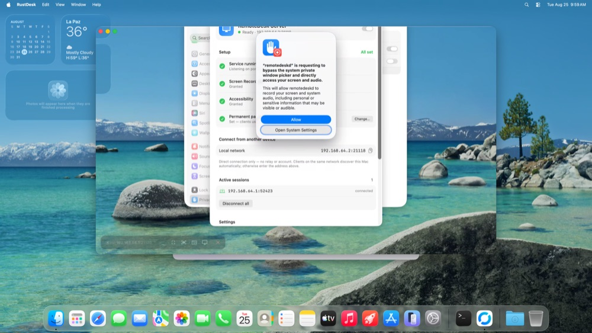
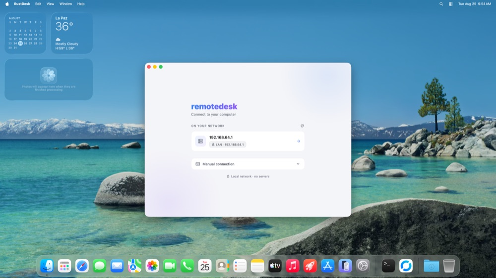
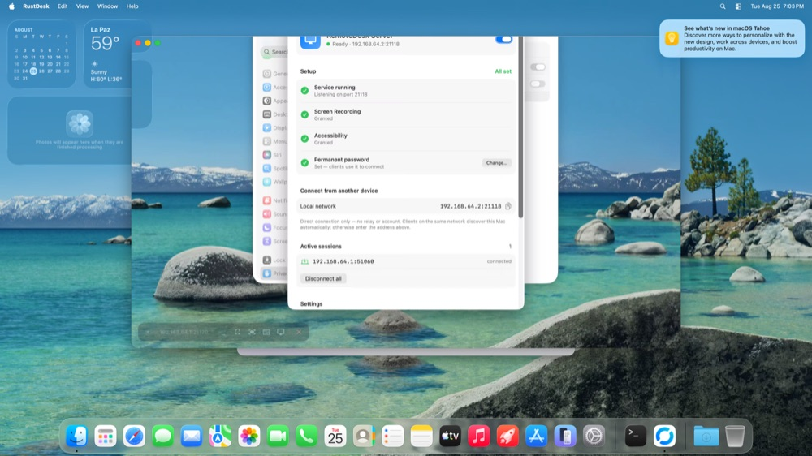

# Remote Display Server (macOS)

Native menu-bar app that runs the Remote Display engine (host) in the background
on the Mac. Replaces the full Flutter `RustDesk.app`: just the headless
Rust engine + a minimal control UI. No client interface, no Flutter.

## What the UI does

Two layers (August 2026), the whole UI in English:

**Menu bar** (`StatusMenu`, native menu style) — only what's needed in the
background: status line (`Ready · 192.168.1.117:21118` / `Running · N permission(s)
missing` / `Stopped`), addresses, active sessions, **Open Remote Display Server…** (⌘O),
*Service Active* and *Open at Login* toggles, *Quit* (⌘Q). The icon carries an alert
badge if setup is incomplete.

**Main window** (`MainWindowView`, grouped `Form` styled like Settings, 560×700) —
all the configuration and status:
- Status + service switch.
- **Setup** (what's done and what's missing, with a button on each pending item): Service running,
  Screen Recording, Accessibility, Permanent password. "N to do / All set" counter.
- **Connect from another device**: LAN and Tailscale `ip:port` with copy.
- **Active sessions**: connected peers (lsof on the engine, port 21118) + *Disconnect all*
  (restarts the engine).
- **Settings**: Open at Login, password (Set…/Change…), access mode.
- **About**: engine version, open logs, reveal configuration.

Opens by itself on startup if setup or password is missing; also on double-click on the app
or a Dock click. While the window is open the app shows up in the Dock
(`.regular`); closing it goes back to being just a menu-bar icon (`.accessory`). Closing the
window doesn't close the app or the engine. **Quitting** the app (⌘Q or the menu bar item)
also stops the engine (the bundle would otherwise stay "in use" and could not be replaced
in /Applications, and a connected client would leave the Mac on a virtual monitor); the
engine restores the displays on SIGTERM. The service stays enabled: the LaunchAgent starts it
again at the next login, and the app starts it when reopened.

## Permissions flow (verified on a clean VM, macOS 26.4, 2026-08-25)

1. First launch → the window opens: *Running · 2 permissions missing*, Setup "3 to do".
2. **Grant… Screen Recording**: `CGRequestScreenCaptureAccess()` adds the app to the list and
   macOS shows its own dialog with *Open System Settings* → *Screen & System Audio Recording*;
   the toggle asks for the admin password; macOS offers "Quit & Reopen / Later" → *Later* is
   enough: the app detects the permission with a probe in a fresh process
   (`remotedisplayd --check-perms`; TCC caches Screen Recording per process) and restarts the
   engine on its own. The app does NOT open Settings itself on the first tap (it used to, on top
   of the dialog, which was redundant); macOS shows the dialog at most once per launch and never
   again after a Deny, so a second *Grant…* tap opens the Settings panel directly.
3. **Grant… Accessibility**: same two-step behaviour; the dialog's *Open System Settings* lands
   on *Accessibility*; toggle + admin password. No restart needed.
4. **Set… Permanent password** (min. 6 characters) → `remotedisplayd --set-lan-password` over IPC.
5. First client connection: macOS 26 shows *"remotedisplayd is requesting to bypass the
   system private window picker and directly access your screen and audio"* → **Allow**. This is
   Apple's periodic screen-capture reminder for apps without a picker; it can come back
   from time to time.
6. If the app is launched from ssh (testing), the local network/TCC prompts appear under
   `sshd-session`; launched normally they appear under Remote Display Server
   (`NSLocalNetworkUsageDescription` in Info.plist).

Codec: in serverless/LAN mode the engine (patch 06, `scrap/codec.rs`) picks **VP9** when the
client is on *Auto*; AV1 only if the client asks for it explicitly. (`av1-test` doesn't help
here: it's a capability probe that the engine rewrites to `'Y'`.) Verified on a VM: with AV1 at 4K the
4-vCPU client never received the first frame (endless "Connecting…").

Robustness: the app remembers whether the user wants the service active (`serviceDesired`) and, if the
engine isn't running (it died, or never started), relaunches it every ≥10 s; the engine without a root
`--service` no longer retries the `ipc_service` 30 times nor tests NAT against 127.0.0.1 in serverless mode.

## Architecture

A single bundle, two executables:

```
Remote Display Server.app/Contents/MacOS/
├── RemoteDisplayServer   ← SwiftUI UI (MenuBarExtra)
└── remotedisplayd        ← Rust engine (cargo, no flutter) = the `rustdesk` binary
```

The engine runs via a LaunchAgent (`~/Library/LaunchAgents/app.remotedisplay.server.plist`,
`RunAtLoad`, **no KeepAlive** — the engine forks and KeepAlive causes a double port
bind). Since the engine lives inside the bundle and is signed with the same identity
as the UI, they share TCC permission attribution.

## Building

1. **Engine** (in the fork's checkout, on the Mac):
   ```sh
   cd engine/rustdesk   # the fork's snapshot
   export PATH="$HOME/.cargo/bin:/usr/bin:/bin:/usr/sbin:/opt/homebrew/bin"
   export LIBCLANG_PATH=/opt/homebrew/opt/llvm@17/lib VCPKG_ROOT=$HOME/vcpkg
   export SDKROOT=$(xcrun --show-sdk-path)
   export BINDGEN_EXTRA_CLANG_ARGS="-isysroot $SDKROOT"
   cargo build --release --bin rustdesk       # → target/release/rustdesk
   ```

2. **App**:
   ```sh
   cd server-mac
   make sign ENGINE_BIN=/path/to/target/release/rustdesk
   # → .build/Remote Display Server.app
   ```

`make sign` signs with the stable `remotedisplay-cs` certificate if it exists in the
keychain (TCC permissions survive rebuilds); otherwise it signs ad-hoc (permissions get
re-granted on every rebuild).

## Installing

```sh
cp -R ".build/Remote Display Server.app" /Applications/
open "/Applications/Remote Display Server.app"
```

First time: enable "Service Active", grant Screen Recording +
Accessibility (the UI's buttons open the panel), set the password.
The Windows client connects via direct IP on port 21118.

## Screenshots (clean VM, macOS 26.4, 2026-08-25)

Full setup and usage flow, as seen on the Tart test bench (resized; originals in `tools/out/`).

**01. first launch, setup window 3 to do**  


**02. grant screen recording opens settings**  


**03. toggle asks for admin password**  


**04. quit and reopen or later**  


**05. screen recording granted**  


**06. grant accessibility opens settings**  


**07. accessibility granted**  


**08. permissions ok, engine restarted**  


**09. set password sheet**  


**10. all set ready**  


**11. client connected and bypass window picker prompt**  


**12. active sessions disconnect all**  


**13. menu bar**  


**14. client vm home**  


**15. client vm video vp9**  

