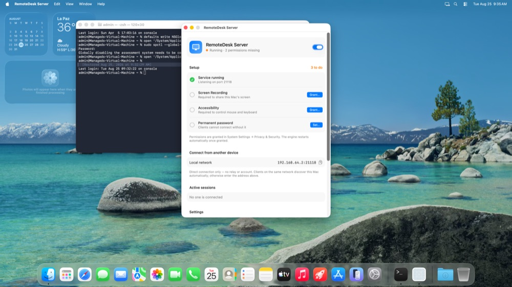
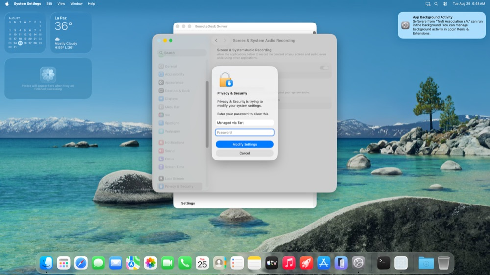
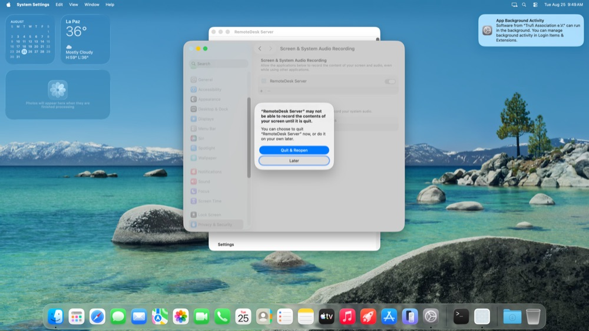
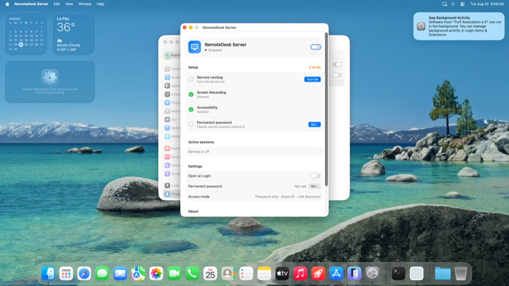
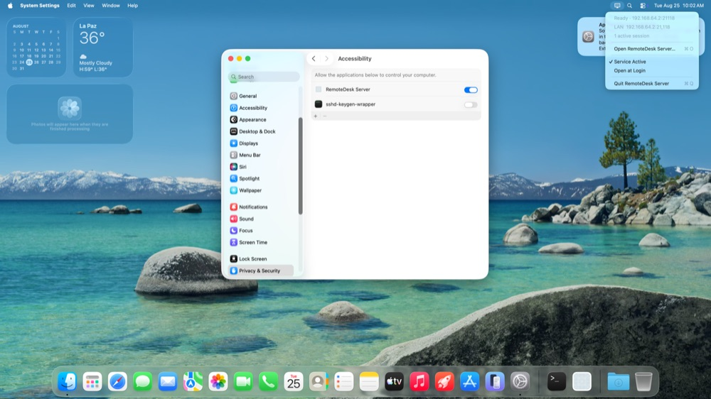

# Remote Display Server (macOS)

App nativa de barra de menú que corre el motor de Remote Display (host) en segundo
plano en el Mac. Reemplaza al `RustDesk.app` completo de Flutter: solo el motor
Rust headless + una UI mínima de control. Sin interfaz de cliente, sin Flutter.

## Qué hace la UI

Dos capas (agosto 2026), toda la UI en inglés:

**Menú de la barra** (`StatusMenu`, estilo menú nativo) — solo lo necesario en
segundo plano: línea de estado (`Ready · 192.168.1.117:21118` / `Running · N permission(s)
missing` / `Stopped`), direcciones, sesiones activas, **Open Remote Display Server…** (⌘O),
toggles *Service Active* y *Open at Login*, *Quit* (⌘Q). El ícono lleva badge de
alerta si falta setup.

**Ventana principal** (`MainWindowView`, `Form` agrupado estilo Ajustes, 560×700) —
toda la configuración y el estado:
- Estado + interruptor del servicio.
- **Setup** (qué está y qué falta, con botón en cada pendiente): Service running,
  Screen Recording, Accessibility, Permanent password. Contador "N to do / All set".
- **Connect from another device**: LAN y Tailscale `ip:puerto` con copiar.
- **Active sessions**: peers conectados (lsof del motor, puerto 21118) + *Disconnect all*
  (reinicia el motor).
- **Settings**: Open at Login, contraseña (Set…/Change…), modo de acceso.
- **About**: versión del motor, abrir logs, revelar configuración.

Se abre sola al arrancar si falta setup o contraseña; también con doble click en la app
o click en el Dock. Mientras la ventana está abierta la app aparece en el Dock
(`.regular`); al cerrarla vuelve a ser solo ícono de barra (`.accessory`). Cerrar la
ventana no cierra la app ni el motor.

## Flujo de permisos (verificado en VM limpia, macOS 26.4, 2026-08-25)

1. Primer arranque → se abre la ventana: *Running · 2 permissions missing*, Setup "3 to do".
2. **Grant… Screen Recording**: `CGRequestScreenCaptureAccess()` agrega la app a la lista y
   se abre Ajustes → *Screen & System Audio Recording*; el toggle pide la contraseña de admin;
   macOS ofrece "Quit & Reopen / Later" → *Later* basta: la app detecta el permiso con una
   sonda en proceso fresco (`remotedisplayd --check-perms`; TCC cachea Screen Recording por
   proceso) y reinicia el motor sola.
3. **Grant… Accessibility**: Ajustes → *Accessibility*; toggle + contraseña admin. Sin reinicio.
4. **Set… Permanent password** (mín. 6 caracteres) → `remotedisplayd --set-lan-password` por IPC.
5. Primera conexión de un cliente: macOS 26 muestra *"remotedisplayd is requesting to bypass the
   system private window picker and directly access your screen and audio"* → **Allow**. Es el
   recordatorio periódico de captura de pantalla de Apple para apps sin picker; puede volver a
   aparecer cada tanto.
6. Si la app se lanza desde ssh (pruebas), los prompts de red local/TCC salen a nombre de
   `sshd-session`; lanzada normalmente salen a nombre de Remote Display Server
   (`NSLocalNetworkUsageDescription` en Info.plist).

Códec: en modo serverless/LAN el motor (parche 06, `scrap/codec.rs`) elige **VP9** cuando el
cliente está en *Auto*; AV1 solo si el cliente lo pide explícitamente. (`av1-test` NO sirve para
esto: es una sonda de capacidad que el motor reescribe a `'Y'`.) Verificado en VM: con AV1 a 4K el
cliente de 4 vCPU nunca recibía el primer frame ("Connecting…" para siempre).

Robustez: la app recuerda si el usuario quiere el servicio activo (`serviceDesired`) y, si el
motor no está corriendo (murió, o no arrancó), lo relanza cada ≥10 s; el motor sin `--service`
root ya no reintenta 30 veces el `ipc_service` ni prueba NAT contra 127.0.0.1 en serverless.

## Arquitectura

Un solo bundle, dos ejecutables:

```
Remote Display Server.app/Contents/MacOS/
├── RemoteDisplayServer   ← UI SwiftUI (MenuBarExtra)
└── remotedisplayd        ← motor Rust (cargo, sin flutter) = binario `rustdesk`
```

El motor corre vía LaunchAgent (`~/Library/LaunchAgents/app.remotedisplay.server.plist`,
`RunAtLoad`, **sin KeepAlive** — el motor forkea y KeepAlive causa doble-bind del
puerto). Como el motor vive dentro del bundle y se firma con la misma identidad
que la UI, comparten la atribución de permisos TCC.

## Compilar

1. **Motor** (en el checkout del fork, en el Mac):
   ```sh
   cd engine/rustdesk   # el snapshot del fork
   export PATH="$HOME/.cargo/bin:/usr/bin:/bin:/usr/sbin:/opt/homebrew/bin"
   export LIBCLANG_PATH=/opt/homebrew/opt/llvm@17/lib VCPKG_ROOT=$HOME/vcpkg
   export SDKROOT=$(xcrun --show-sdk-path)
   export BINDGEN_EXTRA_CLANG_ARGS="-isysroot $SDKROOT"
   cargo build --release --bin rustdesk       # → target/release/rustdesk
   ```

2. **App**:
   ```sh
   cd server-mac
   make sign ENGINE_BIN=/ruta/al/target/release/rustdesk
   # → .build/Remote Display Server.app
   ```

`make sign` firma con el certificado estable `remotedisplay-cs` si existe en el
llavero (permisos TCC sobreviven rebuilds); si no, firma ad-hoc (los permisos se
reotorgan en cada rebuild).

## Instalar

```sh
cp -R ".build/Remote Display Server.app" /Applications/
open "/Applications/Remote Display Server.app"
```

Primera vez: activar "Servicio activo", conceder Grabación de pantalla +
Accesibilidad (los botones de la UI abren el panel), fijar la contraseña.
El cliente Windows conecta por IP directa al puerto 21118.

## Capturas (VM limpia macOS 26.4, 2026-08-25)

Flujo completo de setup y uso, tal como se ve en el banco Tart (reducidas; originales en `tools/out/`).

**01. primer arranque ventana setup 3 to do**  


**02. grant screen recording abre ajustes**  


**03. toggle pide password admin**  


**04. quit and reopen o later**  


**05. screen recording concedido**  


**06. grant accessibility abre ajustes**  


**07. accessibility concedido**  


**08. permisos ok motor reiniciado**  


**09. set password sheet**  


**10. all set ready**  


**11. cliente conectado y prompt bypass window picker**  


**12. active sessions disconnect all**  


**13. menu de la barra**  


**14. cliente vm home**  


**15. cliente vm video vp9**  

